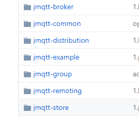

## IoT MQ实现篇：组件选型与插拔式设计

### 概述

本篇是IoT MQ内部实现篇的第一篇，实现篇主要介绍在内部设计和实现时对很复杂的功能点的设计与考虑，也是[jmqtt](https://github.com/Cicizz/jmqtt)的内部的具体实现，本篇主要介绍：

1. 模块化与各个组件的选型
2. 模块插拔式的设计

### 模块化与各个组件的选型

模块化和组件两个概念总是在设计架构时会讨论到的两个概念，一般来说，模块化是指功能上的拆分，将各个功能拆分为模块，组件化指根据模块对于技术上的选型，所以模块化更偏向于功能拆分，组件化更偏向于技术选型与隔离。对于Jmqtt来说，还是采用分层的架构，进行模块化，在根据不同的层进行相应的组件技术选型：

例如，下面是Jmqtt的项目图：



主要就是按照各个功能进行模块化的，详情参考：https://github.com/Cicizz/jmqtt

对于其中两个比较重要的模块的组件都是可插拔式的：

**jmqtt-store** ：主要负责存储mqtt的数据，内部实现了内存和采用rocksdb本地持久化的两种方式

**jmqtt-group** ：主要负责集群通信，目前是基于netty自研的tcp集群通信方式，对于消息中转等，可以用mq方式直接接入，对原代码侵入不大

在模块化时，主要考虑的是功能分类，职责分离，在组件化技术选型和设计时，主要考虑的是插拔式，面向接口设计，并且尽量不引入外部组件，方便运维

### 模块插拔式的设计

架构设计的目的主要就是确定系统的复杂性并在最初的时候就能确定解决方案，但是所有架构又是演进的，对于新的业务需求，总要在原来的系统上添砖加瓦，对于扩展性好的系统来说，新增功能需求都还好，但是如果对于设计不好，扩展性很差的系统来说，可能改的人都要头皮发麻。插拔式设计就是很好的提高系统扩展性的设计之一，在对Jmqtt进行设计和开发时，我对于可插拔的设计主要从两个方面考虑：

1. 可以很方便的进行底层技术组件的替换，例如Jmqtt的存储层可以很方便的替换成其他存储，例如redis等等
2. 可以很方便的进行二次开发，对于使用者来说，如何解决业务需求才是重中之中，在Jmqtt中，主要通过策略模式，命令模式，面向接口的方式，方便用户进行二次开发。

这里以Jmqtt的acl处理为例，介绍如何方便的进行二次开发：

在Jmqtt中，权限主要分为两种：

* 连接权限：主要校验clientid,username,password是否合规等
* 发布订阅权限：主要校验该clientid的设备是否能向该topic发送消息或订阅该topic

jmqtt主要设计两个接口，用于处理校验关系（以连接权限处理为例）：

```java
/**
 * Connect permission manager
 */
public interface ConnectPermission {
    /**
     * Verfy the clientId whether it meets the requirements or not
     */
    boolean clientIdVerfy(String clientId);
    /**
     * if the client is on blacklist,is not allowed to connect
     */
    boolean onBlacklist(String remoteAddr,String clientId);
    /**
     * verfy the clientId,username,password whether true or not
     */
    boolean authentication(String clientId,String userName,byte[] password);
    /**
     * verfy the client's heartbeat time whether the compliance
     */
    boolean verfyHeartbeatTime(String clientId,int time);
}
```

使用者只需要实现该接口，并在BrokerController类中的初始化即可：

```java
{// permission pluggable
    this.connectPermission = new DefaultConnectPermission();
    this.pubSubPermission = new DefaultPubSubPermission();
}
```

这里目前还是需要使用者去修改代码，后续可能会改成用配置项反射加载的方式，其中DefaultConnectPermission是我默认使用的一个关系权限类。

对于插拔式高可扩展性设计，除了面向接口，在Jmqtt中主要用到了：

1. 回调钩子，例如在消息钱处理一个钩子，消息处理后一个钩子

2. 数据扩展接口：例如Jmqtt集群数据处理，在集群传输DTO中保留了一个字段：

   ```java
   private HashMap<String,String> extField;
   ```

该字段就是为了使用者及后续jmqtt扩展时可能会用到时预留的字段。

### 结语

因为Jmqtt主要是开源项目，所以需要预留很多供二次开发的接口，但是对于内部系统而言，模块及组件化一样非常重要，前期设计后可以减少很多后面的工作量，一般来说，扩展设计最好的就是设计成可插拔式的。因为自己这方面经验也不多，这里只简单介绍和总结了下自己这方面的思考及自己在Jmqtt中的实际应用。
