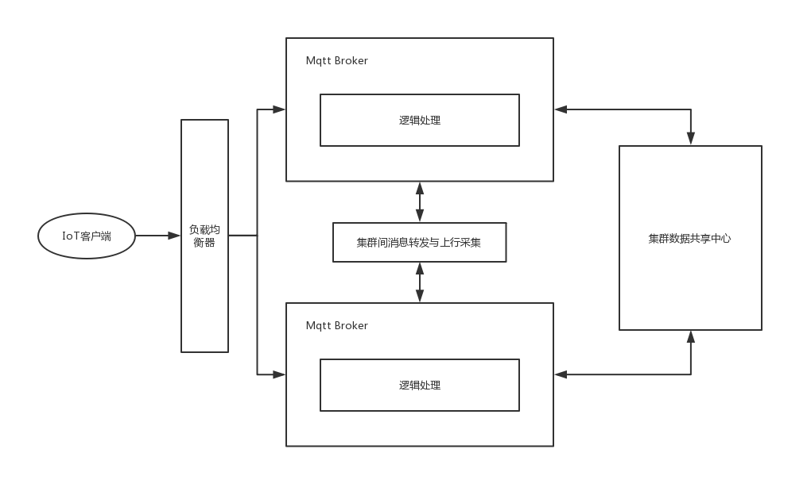
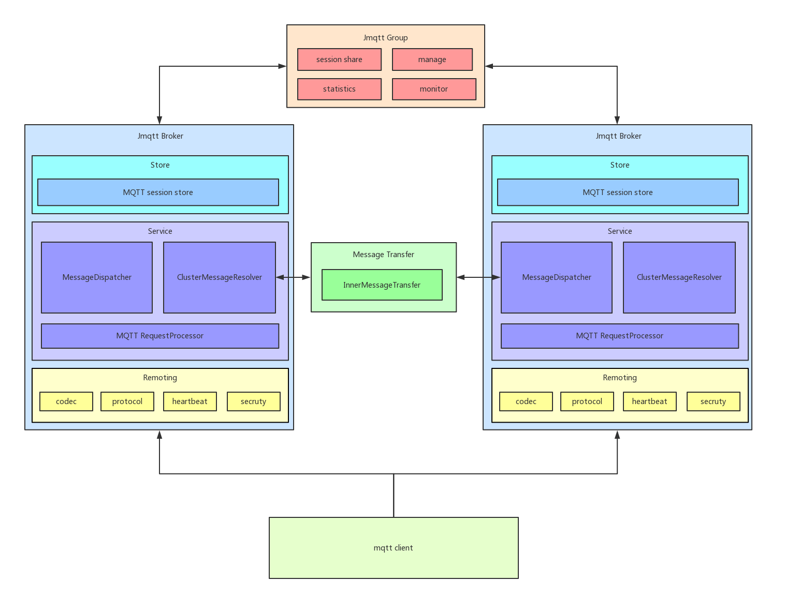

## IoT MQ设计篇：最终架构与jmqtt介绍

### 概述

本篇是IoT MQ设计篇的最后一篇，前面分别介绍了一些IoT MQ的基本信息以及趟过的开源项目的坑，本篇主要介绍下我们在经历一系列问题后确定的最终架构以及我开源的[jmqtt](https://github.com/Cicizz/jmqtt)项目的介绍：

1. 最终架构的确定
2. [jmqtt](https://github.com/Cicizz/jmqtt)介绍
3. 为什么选择主主架构

### 最终架构

在经历对moquette的深入二次开发后，我们发现仍然有很多需求不能满足，但是却掌握了很多基于mqtt协议的开发经验，鉴于此，我们决定完全进行自研，在自研时，我们提出了几个基本需求：

1. 高可用：服务应该是集群的，保证服务的高可用
2. 高可扩展性：鉴于对moquette的开发经验，我们发现可扩展性对后续开发影响非常大，所以设计要合理
3. 功能：功能非常重要，包括p2p（主要用来即时通讯），黑名单管理，权限认证等。
4. 数据收集：需要桥接RocketMQ，Kafka进行数据收集

因为涉及到一些保密信息，这里只做最简单的技术架构思想分享，因为涉及到很多外部组件和定制化开发，相对而言不是很通用并且部署也比较重，后面会具体分享[jmqtt](https://github.com/Cicizz/jmqtt)的设计和实现，下面是一个简单的架构图：

其中最难实现的就是集群间信息管理，这里我们分为了两种：1.客户端会话信息（订阅关系等）；2.集群间消息通信，比如A服务器要把消息发到B服务器上。

1. 客户端信息共享主要处理单点连接，订阅关系保存等，可以采用Redis等中央存储进行处理
2. 集群间消息转发可以采用Kafka等mq进行处理

前端采用F5/Lvx这样的负载均衡器进行路由。这种架构需要维护另外的中央存储集群以及一个消息转发集群，所以维护起来相对比较麻烦，部署依赖也比较多，不是很轻量级，但是设计简单，同时对于很多管理功能等都很好实现。

### [jmqtt](https://github.com/Cicizz/jmqtt)介绍

jmqtt是我在github上开源的一个mqtt server，使用java及netty实现，目标是实现一个java版的高可用，高扩展，插件化，轻量级的Broker，开箱即用。下面是一个Jmqtt的设计图：

client主要通过负载均衡连接到每个broker上，从而进行消息的传输等，Jmqtt与上面的架构设计不同的地方有:

1. 部署更轻量级，依赖更少，只需要部署Jmqtt broker就可以，不需要额外的服务集群
2. 存储目前使用Rocksdb使用，集群计划采用jgroup实现（开发中）
3. 权限认证，集群消息传输，集群数据共享，消息持久化等都是插件化的，方便二次开发
4. 后续计划与其他IoT 协议实现数据互通（计划）

目前Jmqtt已完整实现单机功能，正在实现集群和运维功能管理，详情请参考：https://github.com/Cicizz/jmqtt

### 为什么选择主主架构

这两种架构的设计其实与市场上很多其他的架构设计都很相似，比如emq，hivemq等，我们可以看到这样的架构都是主主架构，相应的，为什么不选择主从架构或主备架构呢。我们先看一下主主架构与和两种架构的区别：

1. 主主：所有的服务都是对等的，都对外提供服务，包括存储，计算等，也就是 **数据分散集群**
2. 主从/主备：主机对外提供服务，从机或备机一般作为冗余处理，例如从机提供读，备机只是数据备份，也就是 **数据集中集群**

像mqtt协议，是客户端直连到mqtt服务器，客户端即要发送消息也要接收消息，并且，像RocketMQ或Kafka都有一个服务发现与注册中心提供给客户端来进行服务的发现（RocketMQ是namesrv，Kafka是ZK）,而mqtt协议的客户端是没有这一项的，所以使用主从/主主并不合适，如果对于数据的可靠性要求很高，可以在存储层做备份处理即可。

上面说了选择jmqtt以及为什么大多数mqtt broker都是主主架构，结合jmqtt再分析一下这三种架构的优缺点：

1. **主主架构** ：优点是实现相对简单，前端直接用负载均衡器即可，但是例如jmqtt，数据只会存储到一台服务器上，然后再需要时再复制到其它服务器上，所以会存在单点故障问题，主主之间无状态，所以不用考虑切换等问题。只需要客户端重新进行复杂均衡即可。
2. **主从（互备式）** ：例如Kafka，每台broker按分区来看，有可能是master，也可能是slave，设计比较复杂，但是数据可靠性比较高，并且对机器利用也很高，缺点是实现很复杂，包括服务的切换，数据复制时机等等都需要考虑
3. **主从（独立式）** ：例如RocketMQ，RocketMQ一般是一主一从式，如果主机挂掉了，从机只提供读服务，然后同一集群的其它主机再提供其它服务，不需要主从切换，实现相对互备式更加简单，也不需要自动切换，这也是RocketMQ去ZK选择自研namesrv进行管理的一个理由，更加轻量级，并且namesrv是无状态的。

### 结语

这是IoT MQ设计篇的最后一篇，后面将继续分享在IoT MQ(主要是jmqtt)的具体实现以及对一些难点问题的思考和解决方案。